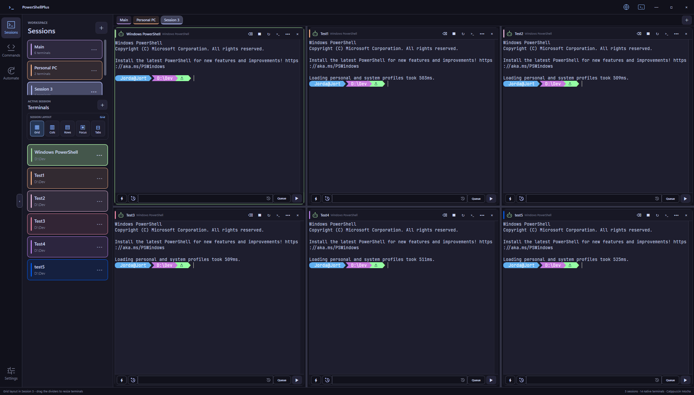
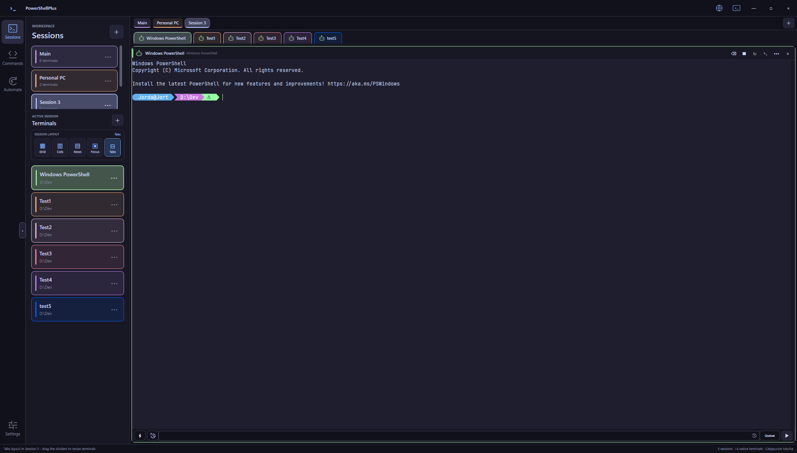

<div align="center">
  
  <h1>PowerShellPlus</h1>
  <p><strong>A native Windows workspace for PowerShell, SSH, Codex, Hermes, and long-running terminal workflows.</strong></p>
  <p>Organize real interactive terminals into persistent Sessions, switch between flexible layouts, recover AI-agent threads, and securely reach your workspace from a browser.</p>
  <p>
    <a href="https://github.com/jordanw0204-rgb/PowerShellPlus/releases/latest"></a>
    <a href="https://github.com/jordanw0204-rgb/PowerShellPlus/actions/workflows/release.yml"></a>
    <a href="https://github.com/jordanw0204-rgb/PowerShellPlus/releases/latest"></a>
    <a href="LICENSE"></a>
  </p>
  <p>
    <a href="https://github.com/jordanw0204-rgb/PowerShellPlus/releases/latest/download/PowerShellPlus-Setup-x64.exe"><strong>Download installer</strong></a>
    · <a href="https://github.com/jordanw0204-rgb/PowerShellPlus/releases/latest/download/PowerShellPlus-Portable-x64.zip">Portable ZIP</a>
    · <a href="https://github.com/jordanw0204-rgb/PowerShellPlus/issues">Report an issue</a>
  </p>
</div>

---

## See it in action

### Grid view

Run several color-coded terminals at once, resize their boundaries, and keep every pane interactive.



### Tabs view

Use the same terminals in a focused, familiar tabbed layout. Layout choice and terminal order are saved per Session.



## Why PowerShellPlus?

PowerShellPlus is designed for workflows that outgrow a row of unrelated terminal windows. A **Session** is a workspace that owns its terminals, active pane, layout, colors, queues, histories, and automation bindings. Switching Sessions changes the workspace without stopping the terminals running in the background.

The terminal surface is native WPF backed by Windows ConPTY and Microsoft TerminalControl. PowerShell, prompts, colors, keyboard input, full-screen console programs, SSH, Codex, and Hermes remain real interactive processes rather than simulated output panels.

| Capability | What it gives you |
| --- | --- |
| Session workspaces | Group terminals by project or purpose and switch without stopping background work. |
| Five layouts | Grid, columns, rows, focus, and draggable tabs—saved independently per Session. |
| AI-agent awareness | Distinct idle, working, and waiting-for-response states for Codex and Hermes. |
| Durable recovery | Restore layouts, transcripts, working folders, SSH recipes, and validated AI-thread metadata after a restart. |
| Local process continuity | Optionally keep a Windows terminal and everything inside it alive in `tmux` through WSL, then reattach after an app restart. |
| Productive composer | Multiline input, per-terminal history, queues, attachments, previews, shortcuts, and font zoom. |
| Remote browser access | View every Session over LAN or securely publish the authenticated web client through Tailscale Funnel. |
| Native handoff | Import Windows Terminal tabs or reconstruct a PowerShellPlus terminal in Windows Terminal after verification. |
| Automations | Run reusable commands manually, on a schedule, or append terminal-specific instructions before sending. |

## Install

### Recommended: Windows installer

1. Download [**PowerShellPlus-Setup-x64.exe**](https://github.com/jordanw0204-rgb/PowerShellPlus/releases/latest/download/PowerShellPlus-Setup-x64.exe).
2. Open the installer and follow the short setup wizard.
3. Launch PowerShellPlus from the Start menu or optional desktop shortcut.

The installer is per-user by default, so administrator access is normally not required. It supports clean upgrades and standard uninstalling through **Windows Settings → Apps**.

> [!NOTE]
> PowerShellPlus is currently unsigned. Windows SmartScreen may show a first-run warning. Confirm that the file came from this repository's Releases page; never disable SmartScreen globally.

### Portable

Download [**PowerShellPlus-Portable-x64.zip**](https://github.com/jordanw0204-rgb/PowerShellPlus/releases/latest/download/PowerShellPlus-Portable-x64.zip), extract it to a writable folder, and run `PowerShellPlus.exe`.

### Requirements

- 64-bit Windows 10 version 1809 or later, or Windows 11.
- Windows PowerShell, included with Windows.
- Windows Terminal is recommended for profile appearance and handoff features, but it is not required.
- Tailscale is required only for optional Global browser access.

## First run

1. Select **+** beside **Sessions** to create a workspace.
2. Select **+** beside **Terminals** to add PowerShell terminals to the active Session.
3. Choose Grid, Columns, Rows, Focus, or Tabs from the Session layout control.
4. Drag dividers or terminal tabs to arrange the workspace.
5. Rename and color-code Sessions and terminals from their context menus.

Closing the main window hides PowerShellPlus in the notification area by default. This keeps the real terminal processes alive. Use the tray menu or Settings when you intentionally want to quit and close the sessions.

## Core workflow

### Sessions and terminals

- Every Session remembers its terminals, active terminal, chosen layout, ordering, divider positions, and accent colors.
- Hovering a Session card briefly previews it; moving away restores the active Session.
- Terminal cards track their current local directory or SSH working directory.
- Tabs and sidebar cards can be reordered by dragging.
- Per-terminal font size and composer font size persist across restarts.

### Command composer

Each terminal has its own command composer, queue, history, quick commands, and automation menu.

| Shortcut | Action |
| --- | --- |
| `Enter` | Send the current input. |
| `Ctrl+Enter` | Add the current input to that terminal's queue. |
| `Shift+Enter` or `Ctrl+J` | Insert a new line. |
| `Ctrl+U` | Remove text from the cursor to the start of the line. |
| `Ctrl+K` | Remove text from the cursor to the end of the line. |
| `Up` / `Down` | Move vertically through multiline input or browse queued entries where appropriate. |
| `Ctrl+Mouse wheel` | Zoom the focused terminal or its composer independently. |
| `Shift+Send` | Send to every open terminal when the configured modifier is enabled. |

The composer grows upward to eight visible lines, then uses a themed scrollbar. Sent entries are stored in per-terminal History with relative timestamps and can be restored with their attachment metadata.

Files can be pasted or dragged into the composer. PowerShellPlus shows reorderable attachment pills and previews images, video, and text. For SSH terminals, referenced local files are copied to a managed remote cache and their paths are rewritten before the message is sent.

### Codex and Hermes

PowerShellPlus derives AI-agent state from pane-scoped process and protocol activity:

- **Green — Idle:** the agent is ready and no response is in progress.
- **Blue — Working:** the agent is actively producing a response or running a turn.
- **Yellow — Waiting for response:** the agent needs approval or user input.

The same indicator appears in terminal headers and Tabs layout. Keyboard echo by itself does not mark an agent as working.

When durable metadata is available, recovery preserves the exact Codex thread, model, approval policy, reviewer, and permission profile. Hermes recovery preserves the exact session and validated model. PowerShellPlus will not silently guess a permission level or bind an ambiguous thread.

### SSH and persistent remote work

PowerShellPlus records a validated SSH connection recipe—destination, user, port, identity/config files, jump host, and a small allowlist of reliability options—without storing passwords, passphrases, or private-key contents.

New SSH terminals can use a pane-specific remote `tmux` session. Choosing **Keep running** closes only the local SSH client while the remote shell, Codex/Hermes turn, and child processes continue. Selecting the detached terminal reattaches to the same remote process and screen state.

### Local tmux through WSL

Local Windows terminals can opt into **Keep this local terminal alive with tmux (WSL)** in the terminal editor. PowerShellPlus verifies WSL, a registered Linux distribution, and `tmux` before changing the terminal. The configured Windows PowerShell still runs with its normal profile, wrappers, working directory, Codex/Hermes process, and SSH client; WSL provides the persistent PTY owner.

If WSL has no registered distribution yet, run `wsl --install -d Ubuntu`, launch Ubuntu once, then install tmux with `sudo apt-get update && sudo apt-get install -y tmux`. See Microsoft's [WSL installation guide](https://learn.microsoft.com/windows/wsl/install) and the official [tmux getting-started guide](https://github.com/tmux/tmux/wiki/Getting-Started).

## Remote browser access

Select the globe in the title bar to open Remote Access.

### LAN mode

- Serves the embedded web client on active private IPv4 interfaces.
- Shows adapter labels and recommends the most useful Wi-Fi/Ethernet address.
- Uses saved-device pairing and starts read-only by default.
- Is intended only for trusted private networks; do not port-forward the LAN endpoint.

### Global mode

- Keeps the PowerShellPlus web server bound to `127.0.0.1`.
- Publishes it through Tailscale Funnel with public HTTPS and WebSocket origin validation.
- Requires Tailscale only on the Windows computer; the phone needs a normal browser and no installed app.
- Stores saved-device secrets as SHA-256 hashes and lets you revoke paired browsers.
- Returns remote typing to read-only whenever Global sharing starts.

PowerShellPlus manages only the Tailscale connection and Funnel route it started. If Tailscale was already connected by the user or another application, stopping sharing leaves that connection alone.

## Recovery and handoff

PowerShellPlus distinguishes live-process continuity from restart recovery:

- **Close to tray:** terminals and every child process stay alive exactly as they are.
- **Application or Windows restart:** panes are recreated from saved layout and validated recovery metadata; previous output remains available from History.
- **Local terminal with WSL tmux:** closing or restarting the app detaches its client; reopening PowerShellPlus reattaches to the same live Windows terminal process.
- **SSH with tmux:** the remote process can remain alive even after the local app fully exits.
- **Windows Terminal import/handoff:** PowerShellPlus performs a controlled reconstruction because Windows cannot move an existing ConPTY client process between terminal hosts.

For safety, a Windows Terminal import does not close its source until review succeeds. A handoff does not remove its source pane until the destination shell proves it started. Unsupported or incomplete Codex permissions, ambiguous threads, unsafe SSH options, and unverifiable destination state fail closed.

> [!IMPORTANT]
> PowerShell variables, loaded modules, in-memory jobs, and arbitrary child-process memory cannot be serialized after a genuine process exit. Recovery preserves everything the underlying tools expose durably; hiding to the tray, local WSL tmux, or remote tmux is the option for exact live state.

## Updates

Installed copies check the latest stable GitHub Release after startup. When a newer version is available, the themed prompt shows its release notes and offers:

- **Update now**
- **Not now**
- **Don't show update notifications again**

Settings includes **Check for updates** for an on-demand check even when automatic notifications are disabled. An accepted installer is downloaded from this repository's exact release asset, bounded by its declared size, and verified against GitHub's SHA-256 digest before Windows opens it. Session recovery data is saved before the update closes the application.

## Security model

- Terminal commands run with the permissions of the existing terminal process; the browser does not create a more privileged shell.
- Codex permission metadata is validated from structured session records rather than inferred from transcript text.
- SSH recovery accepts only structured connection options and leaves authentication and host-key verification to Windows OpenSSH.
- LAN requests are constrained to private-network clients; Global mode exposes only the authenticated loopback web application through Funnel.
- Update redirects are restricted to GitHub release infrastructure and installers must match GitHub's published size and SHA-256 digest.
- Workspace data and transcripts remain local unless you explicitly use Remote Access or send data through a terminal application.

## Local data

PowerShellPlus stores user-created Sessions, terminal profiles, commands, automations, preferences, recovery metadata, and optional transcripts under:

```text
%APPDATA%\PowerShellPlus
```

Saved terminal output can contain sensitive commands or tokens. Transcript persistence can be disabled independently in Settings.

## Build from source

Source builds are intended for contributors and advanced users. Install Git and the current Node.js LTS release, then run:

```powershell
git clone https://github.com/jordanw0204-rgb/PowerShellPlus.git
cd PowerShellPlus
powershell.exe -NoProfile -ExecutionPolicy Bypass -File .\build.ps1
```

The build script restores pinned web assets, installs a project-local .NET 8 SDK when needed, compiles the native application, runs its functional gates, and writes the deployable build to `dist\`.

To build and smoke-test the same installer used by GitHub Releases:

```powershell
powershell.exe -NoProfile -ExecutionPolicy Bypass -File .\build-installer.ps1 -RunSmokeTest
```

The release workflow is triggered by stable `vMAJOR.MINOR.PATCH` tags and publishes the installer, portable ZIP, and SHA-256 checksum file.

## Project structure

```text
PowerShellPlus/
├── native/PowerShellPlus.Native/   Native WPF application and embedded web client
├── installer/                      Inno Setup installer definition
├── scripts/                        Supporting PowerShell utilities
├── electron/                       Legacy Electron fallback host
├── renderer/                       Legacy fallback renderer
├── .github/workflows/              Tag-driven release automation
├── build.ps1                       Native build and functional gates
└── build-installer.ps1             Installer build and isolated smoke test
```

## Troubleshooting

<details>
<summary><strong>The installer or app is blocked by SmartScreen</strong></summary>

PowerShellPlus is currently unsigned. Confirm that the filename and source are this repository's official Releases page, then use Windows' **More info** option if you trust the download. Do not disable SmartScreen globally.
</details>

<details>
<summary><strong>A source build cannot replace files in dist</strong></summary>

The running portable application still has those files open. Quit PowerShellPlus from its tray menu, wait for the process to exit, and run `build.ps1` again.
</details>

<details>
<summary><strong>A recovered SSH terminal cannot reconnect</strong></summary>

Verify the host, network, key/config path, and normal Windows OpenSSH command outside PowerShellPlus. The pane retains its transcript and recovery recipe so you can retry after connectivity or authentication is fixed.
</details>

<details>
<summary><strong>Global Remote Access is unavailable</strong></summary>

Confirm that Tailscale is installed and signed in on the Windows computer, then reopen Remote Access and select Global. The phone does not need Tailscale installed.
</details>

## Contributing

Issues and focused pull requests are welcome. Please describe the terminal mode involved—local PowerShell, SSH, Codex, Hermes, LAN Remote, or Global Remote—and include reproduction steps. Avoid attaching transcripts that contain credentials or private command output.

## License

PowerShellPlus is available under the [MIT License](LICENSE).
